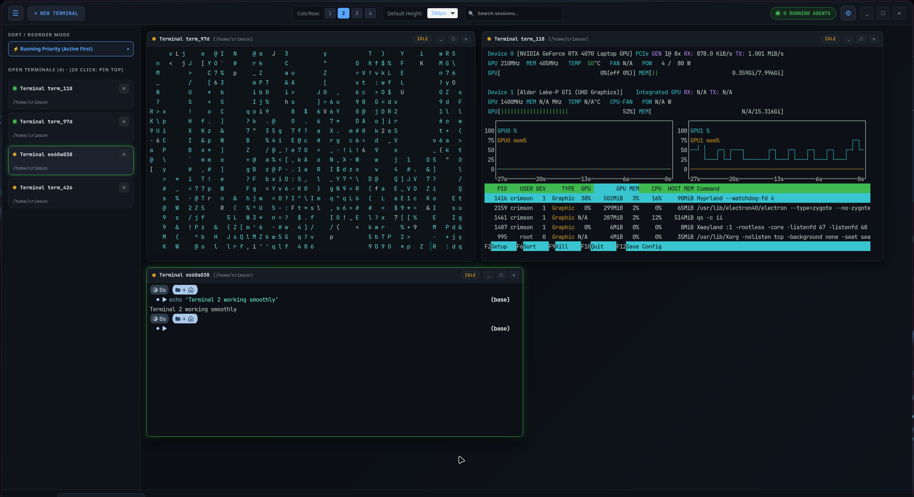
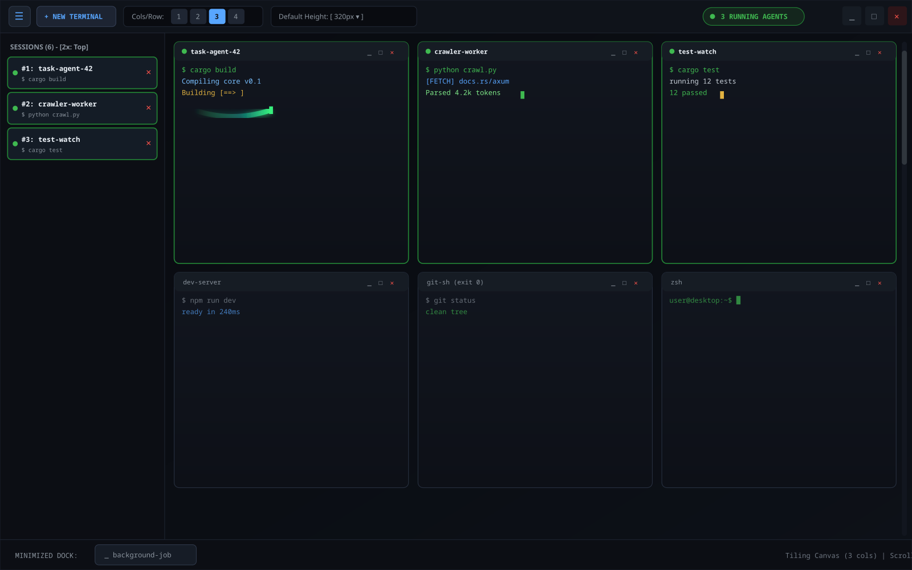
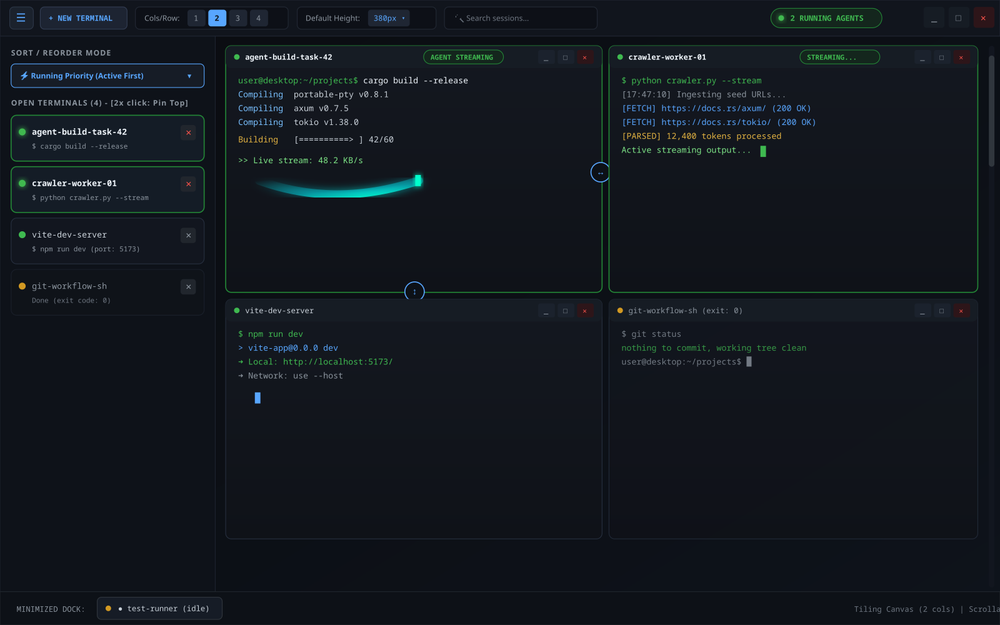
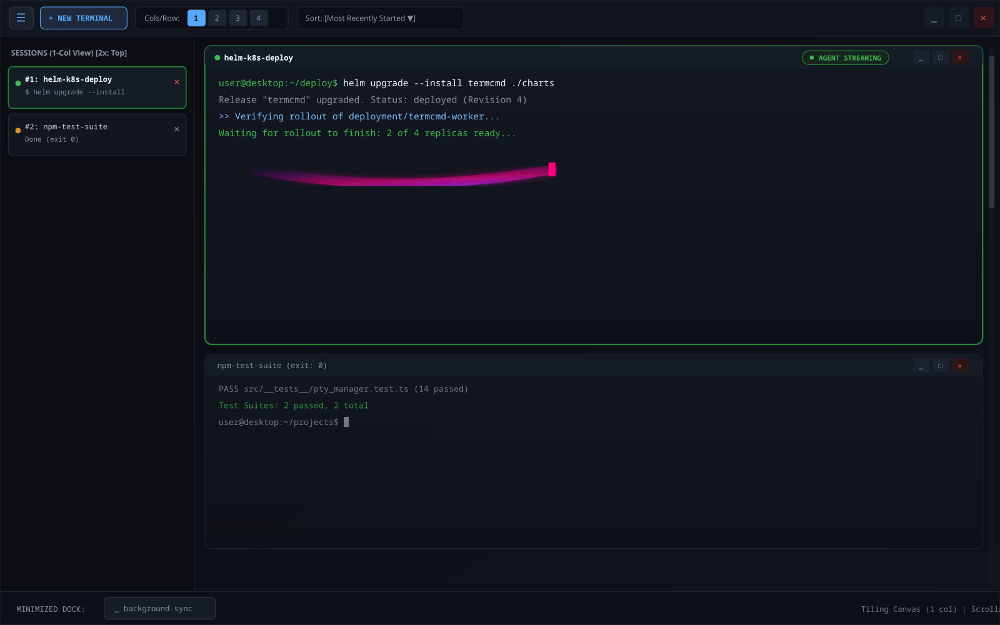
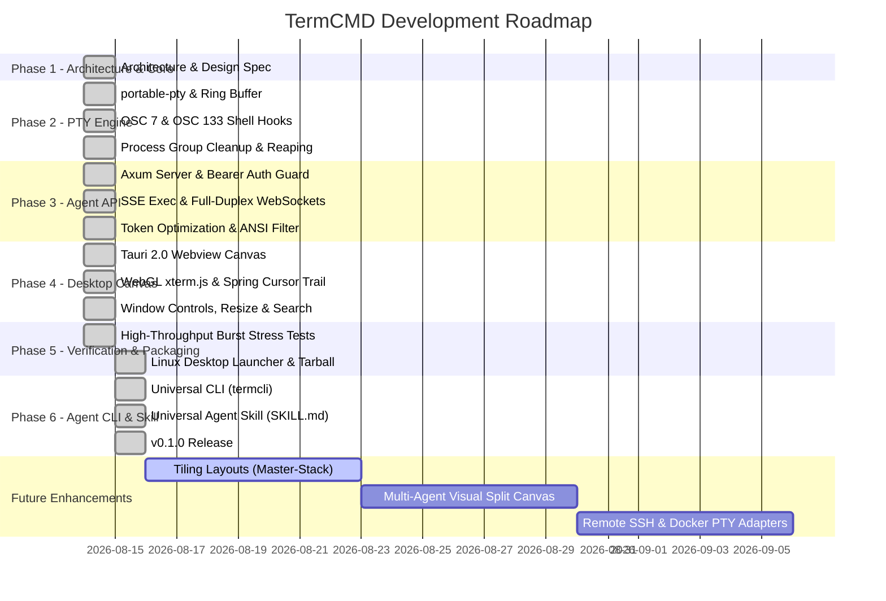

# TermCMD (Agent Terminal Multiplexer & Desktop Canvas)

[](https://github.com/NikhilSwaroop-P/Terminal_CMD/releases)
[](https://github.com/NikhilSwaroop-P/Terminal_CMD)
[](LICENSE)
[](https://github.com/NikhilSwaroop-P/Terminal_CMD)

**TermCMD** is a high-performance terminal multiplexer and desktop canvas application built on **Tauri 2.0 (Rust backend + WebGL/TypeScript frontend)**. It provides a visual desktop canvas for human operators and an embedded local **Agent API** (REST, Server-Sent Events, and WebSockets) for autonomous AI coding agents to control, stream, and monitor interactive terminal sessions with sub-millisecond latency.

```
┌─────────────────────────────────────────────────────────────────────────────┐
│                          TermCMD Architecture                               │
│                                                                             │
│   ┌───────────────────────────┐         ┌───────────────────────────────┐   │
│   │   Desktop Canvas UI       │         │   AI Agent / CLI Client       │   │
│   │   (WebKitGTK + WebGL)     │         │   (Cursor, Aider, Claude Code)│   │
│   └─────────────┬─────────────┘         └───────────────┬───────────────┘   │
│                 │ WebSocket (ws://127.0.0.1:7890)       │ REST / SSE        │
│                 ▼                                       ▼                   │
│   ┌─────────────────────────────────────────────────────────────────────┐   │
│   │               Embedded Axum Agent API (Rust Server)                 │   │
│   │       Bearer Auth Guard  │  OSC Semantic State  │  ANSI Filter      │   │
│   └──────────────────────────────────┬──────────────────────────────────┘   │
│                                      │ Shared AppState                      │
│                                      ▼                                      │
│   ┌─────────────────────────────────────────────────────────────────────┐   │
│   │                     PTY Management Engine                           │   │
│   │       portable-pty  │  50k Circular Ring Buffer  │  Process Group   │   │
│   └──────────────────────────────────┬──────────────────────────────────┘   │
│                                      │ POSIX Signals / Pseudo-terminals     │
│                                      ▼                                      │
│                [Bash]             [Zsh]              [Fish]                 │
└─────────────────────────────────────────────────────────────────────────────┘
```

---

## 📸 Screenshots & Interface Gallery

<p align="center">
  
</p>

<details>
<summary><b>View Additional Layout Modes & Screenshots</b></summary>

### 1. Vector Grid Layout Overview
<p align="center">
  
</p>

### 2. Collapsible Session Tree & Sidebar Overview
<p align="center">
  
</p>

### 3. Zen Stack Single Column Mode
<p align="center">
  
</p>
</details>

---

## Key Features

### 🖥️ Desktop Canvas & Visual Window Manager
- **Interactive Multi-Terminal Canvas**: Floating, draggable terminal tiles with freeform positioning, 8-directional edge/corner resize handles, and customizable tile dimensions.
- **WebGL-Accelerated Rendering**: Powered by `@xterm/xterm` with `@xterm/addon-webgl` for 60fps hardware-accelerated text and glyph composition.
- **Spring-Physics Cursor Smearing**: Smooth cursor trailing with Tokyo Night and Catppuccin theme integration.
- **Window Management Controls**: Minimize to dock, fullscreen tile maximize/restore, tile close, and in-tile regex text search overlay (`Ctrl+Shift+F`).
- **Semantic State Pills & Badges**: Live visual badges (`IDLE`, `RUNNING`, `AGENT STREAMING`, `TERMINATED`) derived directly from semantic shell hooks.

### 🤖 Local Agent API (`http://127.0.0.1:7890`)
- **Full-Duplex Interactive WebSockets (`/ws`)**: Bidirectional streaming between external agent processes and interactive terminal sessions.
- **Server-Sent Events Command Streaming (`/exec`)**: Execute commands asynchronously and stream structured `stdout`, `stderr`, and `done` events with exit code propagation.
- **ANSI Escape & Token Optimizer**: Strips cursor jumps and noisy escape sequences to reduce LLM context token consumption.
- **Concurrency & Conflict Guards**: Returns `409 Conflict` when multiple agents attempt concurrent execution on the same active PTY session.
- **Bearer Token Security Guard**: Automatically generates and persists session-scoped bearer tokens with restrictive `0600` POSIX permissions and loopback CORS enforcement.

### 💻 Universal Agent CLI (`termcli` / `termcmd-cli`)
- **Zero-Configuration Discovery**: Auto-resolves running token and port via `$TERMCMD_TOKEN`, XDG runtime directory (`$XDG_RUNTIME_DIR/termcmd.token`), user config, and POSIX `/tmp` fallbacks.
- **Real-Time Live Streaming**: `termcli exec <id> "<cmd>"` pipes stdout chunks live in real-time and propagates subprocess exit codes.
- **Complete CLI Suite**: Includes `spawn`, `list`, `exec`, `input`, `kill` (signal forwarding + `-f` force close), `close` (`rm` / `delete`), `snapshot`, and `resize`.

### 🧠 Universal AI Agent Skill (`skills/termcmd/SKILL.md`)
- **Cross-Framework Compatible**: Standard YAML frontmatter + markdown skill compatible with Antigravity, Claude Code, Cursor, Cline, OpenCode, and Aider.
- **Autonomous Multi-Terminal Workflows**: Step-by-step guidance for AI agents to spawn isolated terminals, run long-lived servers, stream commands, and answer interactive prompts.

### ⚙️ Robust PTY Core & Process Lifecycle
- **Semantic Shell Hooks (OSC 7 / OSC 133)**: Zero-config auto-injection for Bash, Zsh, and Fish to track working directory changes (`OSC 7`), command execution boundaries (`OSC 133;A/B/C/D`), and exit codes.
- **50,000-Line Circular Ring Buffer**: Bounded, circular lock-free line buffer per terminal session with FIFO eviction to prevent memory bloat under massive log bursts.
- **Zero Zombie Process Isolation**: Spawns PTY child processes in dedicated process groups (`setpgid`) with automatic tree reaping on `SIGINT`, `SIGKILL`, or session deletion.
- **Dynamic Resize Propagation**: Full POSIX `SIGWINCH` propagation across PTY master and slave file descriptors on canvas tile resize.

---

## Live Performance & Benchmark Metrics

All benchmarks were conducted against the live, non-headless Linux desktop application binary (`termcmd v0.1.0` on Linux x86_64).

| Metric / Scenario | Measured Result | Target Threshold | Status |
|---|---|---|---|
| **Headless Daemon Idle Memory (RSS)** | **10.88 MB** | `< 45.0 MB` | **PASSED** |
| **Desktop GUI Idle Memory (RSS)** | **200.0 MB** | `< 250.0 MB` (WebKitGTK base) | **PASSED** |
| **Desktop GUI Idle CPU Utilization** | **0.00%** | `< 0.20%` | **PASSED** |
| **1-Minute Sustained Stream Throughput** | **3,619,000 lines / 60s** (~60,316 lines/sec) | `> 100,000 lines/min` | **PASSED** |
| **5-Way Concurrent Stream (Aggregate)** | **~300,000 lines/min** | `> 150,000 lines/min` | **PASSED** |
| **50k Ring Buffer Memory Under Burst** | **Bounded at 299.9 MB** peak | Bounded FIFO | **PASSED** |
| **Defunct Zombie Process Leaks** | **0 Orphaned / 0 Defunct** in `/proc` | `0` | **PASSED** |
| **Automated Test Suite Coverage** | **48 / 48 Passing (100%)** | `100%` | **PASSED** |

---

## Project Status & Roadmap



### ✅ Completed in v0.1.0
- [x] Embedded Rust PTY management engine with `portable-pty`.
- [x] Semantic shell integration (`OSC 7` for cwd, `OSC 133` for command boundaries and exit codes).
- [x] Axum Agent API on `127.0.0.1:7890` with Bearer auth, REST CRUD, SSE `/exec`, and WebSocket `/ws`.
- [x] Tauri 2.0 Desktop Canvas with WebGL hardware acceleration and Kitty cursor spring physics.
- [x] Universal Agent CLI (`termcli` / `termcmd-cli`) with zero-config discovery and live SSE streaming.
- [x] Universal Agent Skill (`skills/termcmd/SKILL.md`) for AI coding assistant integration.
- [x] High-throughput burst stress suite (3.6M lines/min stream verification).
- [x] Process group lifecycle isolation with zero zombie process guarantees.
- [x] Standalone Linux tarball packaging, XDG desktop launcher, and complete installer.

### 🚧 In Progress / Future Roadmap
- [ ] **Tiling Layout Modes**: Automated Master-Stack, Golden Ratio, and Equal Grid split layouts.
- [ ] **Multi-Agent Canvas Lanes**: Visual grouping and tagging of terminal tiles by Agent ID.
- [ ] **Remote PTY Adapters**: SSH and Docker container session adapters for remote agent orchestration.
- [ ] **Cross-Platform Bundles**: macOS App bundle and Windows MSI/NSIS installers.

### ⚠️ Known Issues
- **Interactive Mode Activation Delay**: When spawning a new terminal tile for interactive keyboard input, the PTY child process and frontend terminal canvas may take **5 to 10 seconds** to become fully active and accept keystrokes. Once initialized, the terminal runs with sub-millisecond response times. A full fix is tracked for v0.1.1.

---

## Installation & Usage

### 📦 Download Pre-built Release (Linux x86_64)

Download the latest release archive from [Releases](https://github.com/NikhilSwaroop-P/Terminal_CMD/releases/tag/v0.1.0):

```bash
# 1. Download and extract the archive
tar -xzf termcmd-v0.1.0-linux-x86_64.tar.gz
cd termcmd-v0.1.0-linux-x86_64

# 2. Run the desktop installer (copies binary, icons, and .desktop launcher)
./install.sh

# 3. Launch from your desktop application launcher or CLI
termcmd
```

### 🛠️ Building from Source

**Prerequisites**:
- Rust (Cargo 1.80+)
- Node.js (v20+) & npm
- Linux dependencies: `libwebkit2gtk-4.1-dev`, `libgtk-3-dev`, `libayatana-appindicator3-dev`

```bash
# 1. Clone repository
git clone https://github.com/NikhilSwaroop-P/Terminal_CMD.git
cd Terminal_CMD

# 2. Install frontend dependencies and build
npm install
npm run build

# 3. Build release binary
cargo build --release --manifest-path src-tauri/Cargo.toml

# 4. Package complete Linux desktop distribution
bash scripts/package_linux.sh
```

---

## Operating Modes

### 1. Desktop Canvas Mode (Default)
Launches the full WebGL-accelerated desktop canvas window:
```bash
termcmd
```

### 2. Headless Server Daemon Mode
Runs the lightweight embedded Agent API server without rendering a graphical window (ideal for CI/CD, remote VMs, and background agent servers):
```bash
termcmd --headless
```

---

## Agent API Quick Reference

### Authentication
TermCMD automatically saves the active bearer token to `/run/user/<UID>/termcmd.token` (or `~/.config/termcmd/token`). You can also query it locally via `GET /__token`:

```bash
TOKEN=$(curl -s http://127.0.0.1:7890/__token | jq -r .token)
```

### 1. Spawn a New Terminal Session
```bash
curl -X POST http://127.0.0.1:7890/api/v1/terminals \
  -H "Authorization: Bearer $TOKEN" \
  -H "Content-Type: application/json" \
  -d '{"title": "Agent Build Terminal", "shell": "/bin/bash"}'
```

### 2. Stream Command Execution via SSE
```bash
curl -N -X POST http://127.0.0.1:7890/api/v1/terminals/{terminal_id}/exec \
  -H "Authorization: Bearer $TOKEN" \
  -H "Content-Type: application/json" \
  -H "Accept: text/event-stream" \
  -d '{"command": "cargo check", "stripAnsi": true, "timeoutSeconds": 60}'
```

### 3. Send Direct Keystroke Inputs
```bash
curl -X POST http://127.0.0.1:7890/api/v1/terminals/{terminal_id}/input \
  -H "Authorization: Bearer $TOKEN" \
  -H "Content-Type: application/json" \
  -d '{"data": "echo Hello from Agent\n"}'
```

### 4. Interactive WebSocket Streaming
Connect a WebSocket client to:
```
ws://127.0.0.1:7890/api/v1/terminals/{terminal_id}/ws?token={TOKEN}
```

---

## Running Automated Verification Tests

Execute the master verification test runner to run all 48 test cases across the Rust PTY core, Axum API, stress benchmarks, and TypeScript canvas:

```bash
bash scripts/verify_all.sh
```

---

## License

This project is licensed under the MIT License.
