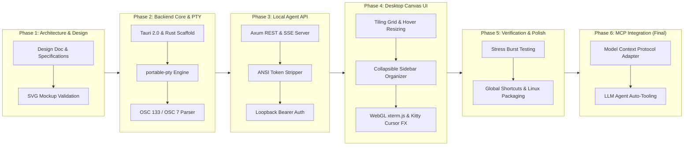

# TermCMD: Agent Terminal Multiplexer & Desktop Canvas
## Comprehensive System Architecture & Technical Design Specification

---

## 1. Executive Summary & Problem Space

### 1.1 Background
Modern autonomous AI agents (such as code-assistants, automated test runners, and DevOps pipelines) rely extensively on shell execution tools. Existing execution models suffer from fundamental limitations:
1. **Stateless Subshells**: Traditional agent tool executions invoke ephemeral `sh -c "<cmd>"` subshells. Environment variables, shell aliases, active virtual environments, directory changes (`cd`), and long-running background processes (e.g., development servers) are lost between tool calls.
2. **Black-Box Execution**: Operators lack real-time observability into what commands agents are executing, preventing timely human-in-the-loop intervention or inspection.
3. **Fragile Output Parsing**: Command exit codes and stdout/stderr boundaries are frequently inferred using fragile wrapper scripts or sentinel strings (`echo __EXIT__$?`), which break when processes emit unescaped control characters or crash prematurely.
4. **Token Inefficiency**: Raw ANSI escape sequences emitted by terminal PTYs unnecessarily inflate LLM token consumption when piped directly into agent context windows.

### 1.2 The TermCMD Solution
**TermCMD** is a dedicated desktop terminal canvas and orchestration manager built on Tauri 2.0 and Rust. It combines:
- A high-performance, asynchronous Rust PTY engine managing persistent shell sessions.
- An embedded local HTTP/SSE/WebSocket server exposing structured endpoints for AI agents and CLI tools.
- Native OSC 133 semantic shell integration for zero-mangling command completion detection and OSC 7 for real-time working directory tracking.
- Intelligent dual-stream output: stripped token-efficient plaintext for AI agents and full WebGL-accelerated truecolor ANSI rendering for the desktop canvas.
- A GPU-accelerated, Kitty-styled multi-window desktop canvas featuring dynamic tiling, edge-hover resizing, priority reordering, and spring-physics cursor trailing.
- A downstream Model Context Protocol (MCP) server adapter (planned as the final milestone) enabling plug-and-play tool calling for all MCP-compatible LLM frameworks.

```mermaid
flowchart TB
    subgraph AgentSpace ["AI Agents & Orchestrators"]
        Agent[AI Agent / LLM Tool / CLI Script]
        MCPAgent[MCP Client - Final Phase]
    end

    subgraph TermCMDApp ["TermCMD Desktop Application (Tauri 2.0)"]
        subgraph Backend ["Rust Backend Core (Tokio Async Runtime)"]
            AuthGuard["Local Token Auth & Loopback Guard"]
            APIServer["Axum Local API Server (Port 7890)"]
            MCPAdapter["MCP Server Adapter (Phase 6 / Final)"]
            SessionRegistry["PTY Session Registry & Ring Buffer"]
            PTYEngine["portable-pty Master / Worker Engine"]
            OSCParser["OSC 133 & OSC 7 Semantic Parser"]
            ANSIFilter["ANSI Stripper & Token Optimizer Engine"]
            ProcessSupervisor["Process Group & Signal Supervisor"]
        end

        subgraph Frontend ["Frontend Webview Canvas (WebGL + TypeScript)"]
            CanvasEngine["Tiling & Resizing Engine (Flex/Grid Tree)"]
            SortManager["Priority & Reordering State Machine"]
            SidebarOrganizer["Collapsible Session Tree & Quick Actions"]
            TerminalInstances["xterm.js + WebGL Terminal Canvas"]
            CursorTrailFX["Kitty-Style Spring Physics Shader Overlay"]
            DockTray["Minimized Window Dock Tray"]
        end
    end

    subgraph OSKern ["Operating System Subprocesses"]
        ShellA["Persistent Shell Session A (PID: 10420)"]
        ShellB["Persistent Shell Session B (PID: 10455)"]
    end

    Agent -->|HTTP POST / SSE / WS (Token Auth)| AuthGuard
    MCPAgent -.->|JSON-RPC / stdio (Phase 6)| MCPAdapter
    MCPAdapter -.-> APIServer
    AuthGuard --> APIServer
    APIServer --> SessionRegistry
    SessionRegistry --> PTYEngine
    PTYEngine --> ProcessSupervisor
    ProcessSupervisor -->|Spawn / I/O / SIGINT / SIGWINCH| ShellA
    ProcessSupervisor -->|Spawn / I/O / SIGINT / SIGWINCH| ShellB
    ShellA -->|stdout / stderr stream| OSCParser
    ShellB -->|stdout / stderr stream| OSCParser
    OSCParser -->|Parsed Events & Exit Codes & CWD| SessionRegistry
    SessionRegistry -->|Clean Plaintext / SSE| ANSIFilter
    ANSIFilter -->|Optimized Tokens| Agent
    SessionRegistry -->|Raw ANSI / WebSockets / IPC| CanvasEngine
    CanvasEngine --> TerminalInstances
    TerminalInstances --> CursorTrailFX
    SidebarOrganizer --> SortManager
    SortManager --> CanvasEngine
    CanvasEngine --> DockTray
```

---

## 2. Detailed Requirements & Constraints

### 2.1 Functional Requirements

#### F1: Persistent PTY Lifecycle & Process Management
- Spawning configurable persistent shell sessions (`/bin/bash`, `/bin/zsh`, `fish`, or custom environments) with full terminal emulation flags (`TERM=xterm-256color`, `COLORTERM=truecolor`).
- Persistent execution context: shell variables, loaded dotfiles, conda/venv virtual environments, working directories, and spawned background daemons survive across sequential API invocations.
- Robust process group termination: capability to send signals (`SIGINT`, `SIGTERM`, `SIGKILL`) directly to foreground process groups without terminating the parent shell instance.
- **Dynamic Terminal Size Synchronization (`SIGWINCH` / `TIOCSWINSZ`)**: Window dimension changes on the canvas trigger continuous PTY column/row recalculations via `ResizeObserver` to prevent CLI rendering artifacts in tools like `htop` or progress bars.
- **Concurrency Guard**: If an `/exec` call targets a terminal running an active process, the server returns `409 Conflict` with an option to route input to stdin or auto-spawn a sibling terminal tile.
- **Post-Exit / Crash Recovery**: When a child shell terminates (e.g. via `exit` or crash), the terminal tile transitions to `[TERMINATED]` state with its exit code, offering a **`↺ Restart Shell`** action that respawns the shell in the exact last-known CWD.

#### F2: Zero-Mangling Semantic Shell Integration (OSC 133 & OSC 7)
- **Command Boundary Detection (OSC 133)**:
  - `OSC 133 ; A ST`: Prompt start marker.
  - `OSC 133 ; B ST`: Command line typed / execution trigger marker.
  - `OSC 133 ; C ST`: Command output start marker.
  - `OSC 133 ; D ; <exitcode> ST`: Command execution completed with exact integer exit code.
- **Dynamic Working Directory Tracking (OSC 7)**:
  - Shell hook emits `OSC 7 ; file://<hostname>/<path> ST` on every prompt return, automatically updating the session CWD in the backend registry, window header, and sidebar without querying the OS process tree.
- Automatic injection of non-destructive shell integration hooks into spawned shells.

#### F3: Embedded Agent API & Dual-Stream Wire Protocols
- Embedded local HTTP server running strictly on loopback (`127.0.0.1:7890`) protected by a session-scoped Bearer token.
- **Dual-Stream Output & ANSI Optimization**:
  - `strip_ansi: true` (default for agents): Emits clean plaintext with zero ANSI escape sequences, optimizing LLM token efficiency.
  - `strip_ansi: false` (for rich consumers): Emits raw truecolor ANSI streams.
- **Interactive Prompt Detection & Timeouts**:
  - Configurable execution timeout (`timeoutSeconds`).
  - If a command pauses output for longer than an interactive threshold without reaching prompt end (`OSC 133 ; D`), the SSE stream emits `event: prompt_waiting` so agents can react and write standard input.
- **Ephemeral Environment Overrides**: Support for an optional `env` map in `/exec` calls to inject single-execution variables without polluting the persistent shell.
- Direct standard input forwarding endpoint (`/api/v1/terminals/:id/input`) for interactive prompts, password inputs, or control keystrokes.
- Session discovery, metadata inspection, and buffer snapshot retrieval endpoints.

#### F4: Canvas Window Manager & Dynamic Tiling Engine
- **Tiling Grid with Infinite Vertical Scroll**: Terminal windows are organized in a structured, fluid grid with configurable columns per row (`1`, `2`, `3`, or `4` columns) and unlimited vertical scrolling.
- **Top-Insertion Hierarchy**: Newly spawned terminal sessions automatically insert at the top-left of the canvas grid.
- **Direct Edge & Corner Hover Resizing**:
  - Dragging any terminal border (top, bottom, left, right) or corner resizes the tile directly.
  - Hovering over borders/corners triggers responsive cursor state changes (`col-resize`, `row-resize`, `nwse-resize`, `nesw-resize`) with luminous edge highlights.
  - Dragging recalculates adjacent tile proportions to preserve grid alignment.
- **Linux Desktop Window Controls**:
  - Titlebars feature standard Linux top-right window controls: Minimize (`_`), Maximize (`□`), and Close/Kill (`✕`).
- **Collapsible Sidebar Organizer**:
  - Left collapsible panel displaying all open sessions with status badges, PID, current working directory, and last executed command.
  - Double-clicking any session immediately floats/scrolls it to the top of the canvas.
  - Instant close/kill action (`✕`) on each sidebar item.
- **Canvas & Sidebar Sorting Modes**:
  - **Mode 1: Running Priority**: Terminals with currently executing commands stay pinned at the top; completed and idle terminals rank below.
  - **Mode 2: Recent Activity (MRU)**: Terminals that just launched a command automatically jump to the top.
  - **Mode 3: Creation Order**: Newest opened terminals positioned at the top.
- **Canvas Productivity Utilities & Shortcuts**:
  - **Copy-on-Select**: Selecting text in any terminal box copies directly to the system clipboard (Kitty behavior).
  - **In-Tile Buffer Search (`Ctrl+Shift+F`)**: Floating search widget within focused terminal tiles.
  - **Clear Scrollback Action**: Header button to clear the active visual buffer.
  - **Global Keybindings**:
    - `Ctrl + Alt + N`: Spawn new terminal tile at top.
    - `Ctrl + Alt + 1..4`: Set grid columns per row.
    - `Ctrl + Alt + W`: Close focused terminal.
    - `Ctrl + Alt + M`: Minimize focused terminal.
    - `Ctrl + Tab` / `Ctrl + Shift + Tab`: Cycle tile focus.

#### F5: Kitty Aesthetics & GPU-Accelerated Cursor Trailing
- Dark, high-contrast aesthetic matching Kitty terminal styling (Tokyo Night / Obsidian palette).
- WebGL-accelerated terminal canvas rendering via `xterm.js` and `@xterm/addon-webgl`.
- Spring-physics cursor trailing effect: A WebGL/Canvas shader overlay tracking cursor coordinate jumps, rendering a glowing luminous trail with velocity-based decay.
- Hardware-accelerated Linux WebKitGTK rendering flags configured for Wayland/X11 compatibility.

#### F6: Model Context Protocol (MCP) Integration (Final Phase Milestone)
- Downstream integration enabling AI agents to connect directly over MCP standard protocols.
- Standard tools: `termcmd_spawn_session`, `termcmd_run_command`, `termcmd_send_input`, `termcmd_list_terminals`, `termcmd_kill_process`.

### 2.2 Non-Functional Requirements

| Metric | Target | Verification Method |
| :--- | :--- | :--- |
| **Keystroke Input Latency** | $< 8\text{ ms}$ | High-frequency timestamped input-to-render loop measurement |
| **Log Streaming Burst Throughput** | $> 100,000\text{ lines/min}$ | Stress benchmark streaming continuous stdout without UI frame drops |
| **PTY Spawn Latency** | $< 50\text{ ms}$ | Time from API request to active PTY prompt confirmation |
| **Idle Memory Footprint** | $< 45\text{ MB}$ | Process resident set size (RSS) during idle state |
| **Memory per Active Terminal** | $< 10\text{ MB}$ | Incremental RSS per spawned xterm + PTY instance |
| **Idle CPU Utilization** | $< 0.2\%$ | CPU usage across all worker threads during idle state |
| **Security Isolation** | Localhost only | Strict loopback socket binding (`127.0.0.1`) + UUID bearer token guard |

---

## 3. Subsystem Architecture & Technical Decomposition

### 3.1 Rust Backend Core Architecture

The backend is built in Rust using the `Tokio` asynchronous runtime, `portable-pty` for cross-platform PTY abstraction, and `Axum` for the embedded HTTP/WebSocket server.

```
+------------------------------------------------------------------------------------+
|                                 Rust Backend Core                                  |
|                                                                                    |
|  +------------------------+  +------------------------+  +----------------------+  |
|  |     Axum API Server    |  |  Session Registry      |  |  OSC 133 / 7 Parser  |  |
|  |  - REST Endpoints      |  |  - Arc<RwLock<Map>>    |  |  - State Machine     |  |
|  |  - SSE Event Broadcaster| |  - Ring Buffer Storage |  |  - Exit Code Decoder |  |
|  |  - ANSI Stripper Engine|  |  - Broadcaster Channel |  |  - OSC 7 CWD Decoder |  |
|  +------------------------+  +------------------------+  +----------------------+  |
|               |                          |                          |              |
|  +------------------------------------------------------------------------------+  |
|  |                        PTY Engine (portable-pty)                             |  |
|  |  - Master/Slave Forking        - File Descriptor I/O Handlers                |  |
|  |  - Non-blocking Reader Loop   - Process Group Signal & SIGWINCH Controller   |  |
|  +------------------------------------------------------------------------------+  |
|                                                                                    |
|  +------------------------------------------------------------------------------+  |
|  |                MCP Server Adapter (Phase 6 / Final Milestone)                |  |
|  |  - JSON-RPC stdio Handler      - MCP Tool Definition Schema                  |  |
|  +------------------------------------------------------------------------------+  |
+------------------------------------------------------------------------------------+
```

### 3.2 Shell Integration Specification (OSC 133 & OSC 7)

#### Bash Integration Hook
```bash
__termcmd_prompt_start() {
    printf "\033]133;A\007"
    printf "\033]7;file://%s%s\007" "$HOSTNAME" "$PWD"
}
__termcmd_prompt_end() {
    printf "\033]133;B\007"
}
__termcmd_preexec() {
    printf "\033]133;C\007"
}
__termcmd_postexec() {
    local exit_code=$?
    printf "\033]133;D;%d\007" "$exit_code"
}
PROMPT_COMMAND="__termcmd_postexec; __termcmd_prompt_start; ${PROMPT_COMMAND:-}"
PS1="\[\033]133;B\007\]$PS1"
trap '__termcmd_preexec' DEBUG
```

#### Zsh Integration Hook
```zsh
__termcmd_precmd() {
    local exit_code=$?
    printf "\033]133;D;%d\007" "$exit_code"
    printf "\033]7;file://%s%s\007" "$HOST" "$PWD"
    printf "\033]133;A\007"
}
__termcmd_preexec() {
    printf "\033]133;C\007"
}
autoload -Uz add-zsh-hook
add-zsh-hook precmd __termcmd_precmd
add-zsh-hook preexec __termcmd_preexec
PS1=$'%{\e]133;B\a%}'"$PS1"
```

---

## 4. Agent Local API Specification

### 4.1 Authentication & Base Configuration
- **Base URL**: `http://127.0.0.1:7890`
- **Authentication Header**: `Authorization: Bearer <TERMCMD_TOKEN>` (generated at startup and saved to `$XDG_RUNTIME_DIR/termcmd.token` or app config).

### 4.2 REST & SSE Endpoints

#### 1. Create Terminal Session
- **`POST /api/v1/terminals`**
- **Request Body**:
```json
{
  "title": "Build Runner",
  "cwd": "/home/user/projects/termcmd",
  "shell": "/bin/bash",
  "cols": 120,
  "rows": 35,
  "env": {
    "RUST_LOG": "debug"
  }
}
```
- **Response `201 Created`**:
```json
{
  "id": "term_9f8a3b12",
  "title": "Build Runner",
  "cwd": "/home/user/projects/termcmd",
  "pid": 14205,
  "state": "IDLE",
  "createdAt": "2026-08-14T17:55:00Z"
}
```

#### 2. List All Terminal Sessions
- **`GET /api/v1/terminals`**
- **Response `200 OK`**:
```json
{
  "terminals": [
    {
      "id": "term_9f8a3b12",
      "title": "Build Runner",
      "cwd": "/home/user/projects/termcmd",
      "pid": 14205,
      "state": "RUNNING",
      "activeCommand": "cargo build --release",
      "commandStartedAt": "2026-08-14T17:55:10Z"
    }
  ]
}
```

#### 3. Execute Command & Stream Output (SSE)
- **`POST /api/v1/terminals/:id/exec`**
- **Request Body**:
```json
{
  "command": "cargo build --release",
  "stripAnsi": true,
  "timeoutSeconds": 300,
  "env": {
    "CARGO_TERM_COLOR": "always"
  }
}
```
- **Response Headers**: `Content-Type: text/event-stream; charset=utf-8`, `Cache-Control: no-cache`
- **SSE Stream Data Frames**:
```
event: start
data: {"command":"cargo build --release","timestamp":"2026-08-14T17:55:10.120Z"}

event: stdout
data:    Compiling termcmd-core v0.1.0 (/home/user/projects/termcmd)

event: stdout
data:    Compiling portable-pty v0.8.1

event: prompt_waiting
data: {"promptText":"Do you want to continue? [Y/n] ","idleMs":1500}

event: done
data: {"exitCode":0,"durationMs":3420,"command":"cargo build --release","cwd":"/home/user/projects/termcmd"}
```
- **Error Response `409 Conflict`**:
```json
{
  "error": "TerminalBusy",
  "message": "Terminal is currently executing PID 14280 ('npm run dev'). Use /input to send stdin or spawn a new terminal.",
  "activePid": 14280
}
```

#### 4. Resize Terminal Dimensions (`SIGWINCH`)
- **`POST /api/v1/terminals/:id/resize`**
- **Request Body**:
```json
{
  "cols": 140,
  "rows": 40
}
```
- **Response `200 OK`**: `{"resized": true, "cols": 140, "rows": 40}`

#### 5. Send Interactive Input Keystrokes
- **`POST /api/v1/terminals/:id/input`**
- **Request Body**:
```json
{
  "data": "yes\n"
}
```
- **Response `200 OK`**: `{"success": true}`

#### 6. Send Process Signal / Interrupt
- **`POST /api/v1/terminals/:id/kill`**
- **Request Body**:
```json
{
  "signal": "SIGINT"
}
```
- **Response `200 OK`**: `{"signaled": true, "signal": "SIGINT"}`

#### 7. Close Terminal & Remove Window
- **`DELETE /api/v1/terminals/:id`**
- **Response `200 OK`**: `{"closed": true}`

---

## 5. UI/UX Engine & Canvas Algorithms

### 5.1 Tiling & Dynamic Grid Layout Engine

The canvas window manager structures terminal windows into a responsive grid calculation with user-configurable column density:

$$\text{Column Width} = \frac{\text{Canvas Width} - (\text{Columns} - 1) \times \text{Gutter Width}}{\text{Columns}}$$

```
+-------------------------------------------------------------------------------------+
| Top Navigation Bar: [☰ Sidebar] [+ New Terminal] [Cols: 1|2|3|4] [Height: 380px]  _ □ ✕|
+-------------------------------------------------------------------------------------+
| SIDEBAR      | CANVAS (Infinite Vertical Scroll)                                    |
|              |                                                                      |
| [Search...]  | +--[ Terminal 1: ~/core ]---[ _ □ ✕ ]-+ +--[ Terminal 2: ~/app ]-[ _ □ ✕ ]-+ |
|              | |                                     | |                                  | |
| Priority:    | |  [RUNNING PRIORITY #1]              | |  [RUNNING PRIORITY #2]           | |
| [Running  ▾] | |  $ cargo build --release            | |  $ python crawl.py               | |
|              | |  Compiling...                       | |  [FETCH] 200 OK                  | |
| Sessions:    | |  █ (Glowing Kitty Trail)            | |  █                               | |
| ● Term 1 [✕] | +-------------------------------------+ +----------------------------------+ |
| ● Term 2 [✕] |                                                                      |
| ○ Term 3 [✕] | +--[ Terminal 3: ~/docs ]---[ _ □ ✕ ]-+ +--[ Terminal 4: ~/test ]-[ _ □ ✕ ]-+ |
| ○ Term 4 [✕] | |  [IDLE / COMPLETED]                 | |  [IDLE / COMPLETED]              | |
|              | |  $ git status                       | |  user@desktop:~$                 | |
|              | +-------------------------------------+ +----------------------------------+ |
+-------------------------------------------------------------------------------------+
| Minimized Dock: [● Term 5 (idle)] [● Term 6 (idle)]                                 |
+-------------------------------------------------------------------------------------+
```

### 5.2 Direct Edge/Corner Hover Resizing Algorithm

Each terminal tile is bounded by an interactive hover zone:
- **Left / Right Borders**: Width $= 6\text{px}$, cursor set to `col-resize` (`↔`).
- **Top / Bottom Borders**: Height $= 6\text{px}$, cursor set to `row-resize` (`↕`).
- **Corners**: $12\text{px} \times 12\text{px}$ bounding box, cursor set to `nwse-resize` (`⤡`) or `nesw-resize` (`⤢`).

When a drag event occurs on border index $i$:
1. The delta offset $\Delta x$ or $\Delta y$ is captured.
2. The active terminal dimension updates: $W_i' = \max(W_{\min}, W_i + \Delta x)$.
3. The adjacent tile dimension updates complementarily: $W_{i+1}' = \max(W_{\min}, W_{i+1} - \Delta x)$ to preserve total row width.
4. If dragged beyond minimum constraints ($W_{\min} = 260\text{px}$, $H_{\min} = 180\text{px}$), clamping prevents layout clipping.
5. On drag release or continuous debounced intervals ($16\text{ms}$), `ResizeObserver` sends `TIOCSWINSZ` resize events to the backend PTY.

### 5.3 Spring-Physics Cursor Trailing Shader

Kitty's animated cursor trail is implemented via an overlay WebGL fragment shader synchronized with xterm.js character grid coordinates $(X_{\text{cursor}}, Y_{\text{cursor}})$:

1. **Particle State Interpolation**:
   When the cursor moves from $(x_0, y_0)$ to $(x_1, y_1)$, a spring-damper equation governs the trail tail:

   $$m \frac{d^2 \mathbf{p}}{dt^2} + c \frac{d\mathbf{p}}{dt} + k (\mathbf{p} - \mathbf{p}_{\text{target}}) = 0$$

   - Stiffness $k = 240.0$
   - Damping $c = 18.0$
   - Mass $m = 1.0$

2. **Luminous Trail Ribbon**:
   A quadratic Bezier curve connects the lagging tail to the leading cursor head, rendered with an exponential glow falloff:

   $$I(d) = I_0 \cdot \exp\left(-\frac{d^2}{2\sigma^2}\right)$$

   where $d$ is the orthogonal distance from the curve and $\sigma$ is the glow radius ($6\text{px}$).

---

## 6. Project Structure & Code Organization

```
Terminal_CMD/
├── README.md
├── docs/
│   ├── DESIGN_DOC.md
│   └── mockups/
│       ├── mockup_a_sidebar_expanded.svg
│       ├── mockup_b_grid_tiles.svg
│       └── mockup_c_stacked_zen.svg
├── src-tauri/
│   ├── Cargo.toml
│   ├── tauri.conf.json
│   └── src/
│       ├── main.rs
│       ├── lib.rs
│       ├── api/
│       │   ├── mod.rs
│       │   ├── routes.rs
│       │   ├── auth.rs
│       │   ├── sse.rs
│       │   └── ansi_filter.rs
│       ├── mcp/
│       │   ├── mod.rs
│       │   └── schema.rs
│       ├── pty/
│       │   ├── mod.rs
│       │   ├── manager.rs
│       │   ├── session.rs
│       │   ├── osc133.rs
│       │   ├── osc7.rs
│       │   └── hooks.rs
│       └── state/
│           └── registry.rs
├── src/
│   ├── index.html
│   ├── main.ts
│   ├── styles/
│   │   ├── main.css
│   │   ├── kitty-theme.css
│   │   └── tiling.css
│   ├── components/
│   │   ├── Canvas.ts
│   │   ├── Tile.ts
│   │   ├── Sidebar.ts
│   │   ├── Dock.ts
│   │   ├── TopBar.ts
│   │   └── SearchOverlay.ts
│   ├── services/
│   │   ├── ApiClient.ts
│   │   ├── PtyStream.ts
│   │   ├── Clipboard.ts
│   │   └── SortManager.ts
│   └── effects/
│       ├── CursorTrail.ts
│       └── WebGLShader.ts
├── package.json
├── tsconfig.json
└── vite.config.ts
```

---

## 7. Project Roadmap & Implementation Milestones


