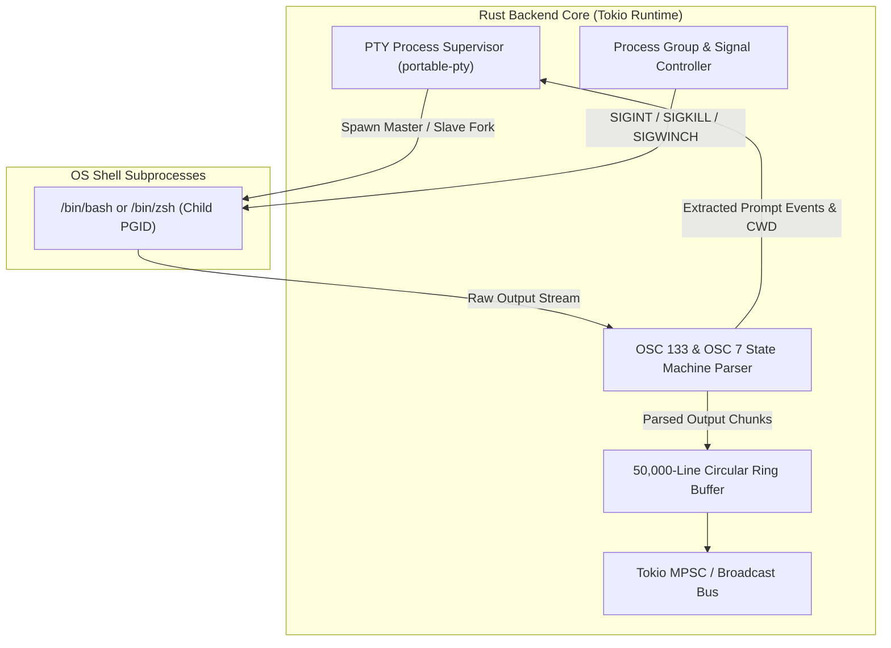

# TermCMD: Phase 2 Backend Core & PTY Engine Execution Plan

---

## 1. Phase 2 Objectives & Scope

Phase 2 focuses on building the **Rust Backend Core & Asynchronous PTY Engine** for TermCMD. This forms the low-level foundation for spawning persistent shells, intercepting semantic prompt escape sequences, routing real-time stdout/stderr streams, and handling process group signals.



---

## 2. Detailed Work Breakdown Structure (WBS)

### Sub-Milestone 2.1: Tauri 2.0 Scaffold & Cargo Dependencies
- Initialize the Tauri 2.0 desktop project structure (`src-tauri/Cargo.toml`, `src-tauri/tauri.conf.json`).
- Configure required Rust dependencies:
  - `portable-pty = "0.8"` (cross-platform pseudo-terminal abstraction)
  - `tokio = { version = "1.38", features = ["full"] }` (async runtime)
  - `serde = { version = "1.0", features = ["derive"] }` & `serde_json = "1.0"`
  - `bytes = "1.6"` & `parking_lot = "0.12"` (high-performance primitives)
  - `tracing = "0.1"` & `tracing-subscriber = "0.3"` (structured logging)
  - `nix = { version = "0.29", features = ["signal", "process"] }` (Linux POSIX signal handling)

### Sub-Milestone 2.2: PTY Process Supervisor & Slave Shell Forking
- **Shell Environment Construction**:
  - Automatically detect user's default shell (`$SHELL` or `/bin/bash`).
  - Configure terminal environment variables: `TERM=xterm-256color`, `COLORTERM=truecolor`, `LANG=en_US.UTF-8`.
  - Dynamically inject non-destructive shell integration hooks (Bash `PROMPT_COMMAND` / Zsh `add-zsh-hook`) via a dedicated wrapper startup script.
- **Dedicated Non-Blocking Reader Loop**:
  - Background asynchronous task per terminal reading raw bytes from the master PTY file descriptor in 4KB chunks.
  - Zero-copy streaming into the parsing engine and broadcast channel.

### Sub-Milestone 2.3: OSC 133 & OSC 7 State Machine Byte Parser
- **Zero-Allocation Byte-by-Byte State Machine**:
  - Scans continuous binary stream for ANSI escape prefixes: `\x1b]133;` and `\x1b]7;`.
  - Decodes semantic prompt states:
    - `OSC 133 ; A ST`: Prompt start (shell ready for input).
    - `OSC 133 ; B ST`: Command line entered / execution begins.
    - `OSC 133 ; C ST`: Command output streaming begins.
    - `OSC 133 ; D ; <exitcode> ST`: Command finished with exact exit code.
  - Decodes directory updates:
    - `OSC 7 ; file://<host>/<path> ST`: Extracts working directory path and updates session CWD metadata instantly.

### Sub-Milestone 2.4: Process Group Supervision & Signal Dispatching
- **POSIX Process Group Isolation**:
  - Each spawned PTY process allocates a distinct process group ID (`setpgid`).
  - Signal dispatching logic:
    - `SIGINT` (`Ctrl+C`): Sent directly to the foreground process group in the PTY without killing the parent shell.
    - `SIGTERM` / `SIGKILL`: Dispatched to cleanup child process groups upon terminal termination.
- **Dynamic Window Resizing (`SIGWINCH` / `TIOCSWINSZ`)**:
  - Method `resize(cols, rows)` that executes `portable_pty::MasterPty::resize(PtySize)` to update kernel dimensions.

### Sub-Milestone 2.5: Bounded Circular Ring Buffer
- Fixed-capacity circular buffer storing up to 50,000 lines of output per session.
- Thread-safe access via `parking_lot::RwLock`.
- Methods:
  - `push_chunk(bytes)`: Appends incoming data with automatic eviction of oldest lines when full.
  - `get_snapshot()`: Returns recent buffer history for newly connected API consumers or UI mounts.
  - `clear()`: Wipes scrollback buffer on demand.

### Sub-Milestone 2.6: Post-Exit & Crash Recovery
- Asynchronous task monitors child process exit status.
- If the shell exits:
  - Transitions session status to `State::Terminated { exit_code }`.
  - Retains buffer history and last-known CWD.
  - Provides a `respawn()` method to relaunch a fresh shell in that exact directory.

---

## 3. Rust Code Structure for Phase 2

```
src-tauri/
├── Cargo.toml
├── tauri.conf.json
└── src/
    ├── main.rs
    ├── lib.rs
    ├── pty/
    │   ├── mod.rs             <-- PTY module exports
    │   ├── manager.rs         <-- PTY lifecycle & session map
    │   ├── session.rs         <-- Single PTY instance & reader loop
    │   ├── osc133.rs          <-- Semantic prompt parser
    │   ├── osc7.rs            <-- Working directory parser
    │   ├── hooks.rs           <-- Shell integration snippets
    │   └── buffer.rs          <-- 50,000-line ring buffer
    └── state/
        ├── mod.rs
        └── registry.rs        <-- Global session registry
```

---

## 4. Verification & Testing Plan for Phase 2

### 4.1 Automated Rust Unit Tests (`cargo test`)
1. **`test_pty_spawn_and_prompt`**:
   - Spawns a real `/bin/bash` instance.
   - Asserts initial prompt emissions and receipt of `OSC 133 ; A` and `OSC 7` sequences.
2. **`test_osc133_exit_code_capture`**:
   - Executes `(exit 42)` in a test PTY.
   - Asserts the parser correctly extracts `exit_code: 42`.
3. **`test_osc7_cwd_tracking`**:
   - Executes `cd /tmp` in a test PTY.
   - Asserts session CWD transitions to `/tmp`.
4. **`test_sigint_process_isolation`**:
   - Spawns a sleeping subprocess (`sleep 100`).
   - Sends `SIGINT` and asserts the sleep command terminates with exit code $130$ while the parent shell stays alive.
5. **`test_ring_buffer_eviction`**:
   - Ingests 60,000 lines into a 50,000-line buffer.
   - Asserts memory stays bounded and the latest 50,000 lines remain accurate.

### 4.2 Integration Verification Script (`scripts/verify_pty.rs` or shell harness)
- Interactive CLI harness spawning 4 parallel PTYs, verifying concurrent streaming and accurate exit code extraction.
