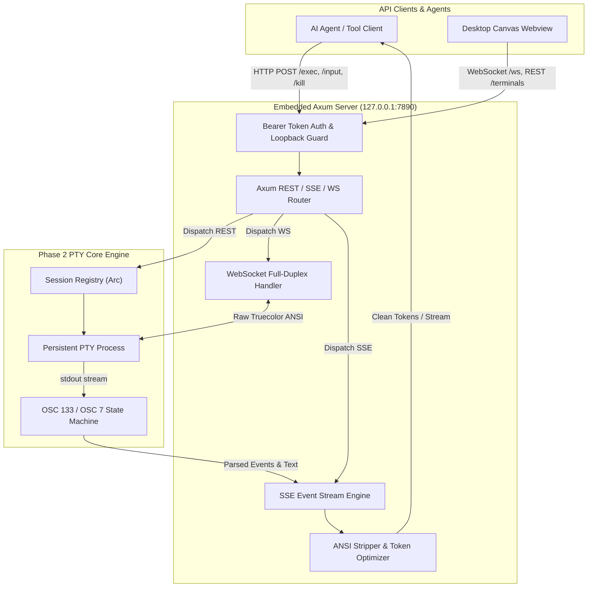

# TermCMD: Phase 3 Embedded Local Agent API & Dual Streaming Execution Plan

---

## 1. Phase 3 Objectives & Scope

Phase 3 focuses on building the **Embedded Local API Server & Dual-Streaming Engine** in Rust using `Axum`, `Tokio`, and `Tower`. This layer exposes structured REST, Server-Sent Events (SSE), and WebSocket endpoints for AI agents, CLI tools, and the frontend desktop canvas to orchestrate persistent PTY instances, stream stdout/stderr real-time, detect interactive prompts, and optimize LLM token consumption.



---

## 2. Detailed Work Breakdown Structure (WBS)

### Sub-Milestone 3.1: Axum Server Setup & Security Guard
- **Server Bootstrap & Lifecycle**:
  - Embedded `axum::Router` running on `127.0.0.1:7890` (with fallback to adjacent ports if busy).
  - Background task managed cleanly inside the Tauri application lifecycle.
- **Bearer Token Authentication Middleware**:
  - Generate a secure UUID v4 / hex token on startup (`TERMCMD_TOKEN`).
  - Persist token to `$XDG_RUNTIME_DIR/termcmd.token` (or `~/.config/termcmd/token`) with `0600` POSIX permissions.
  - Require `Authorization: Bearer <TOKEN>` header on all `/api/v1/*` requests.
- **CORS & Loopback Enforcement**:
  - Restrict CORS origin strictly to `tauri://localhost`, `http://localhost:*`, and `http://127.0.0.1:*`.

### Sub-Milestone 3.2: REST Endpoints Implementation
- **`POST /api/v1/terminals` (Create Session)**:
  - Payload: `{ "title": "...", "cwd": "...", "shell": "...", "cols": 120, "rows": 35, "env": {...} }`.
  - Spawns a new persistent PTY session via Phase 2 `SessionRegistry`.
  - Returns `201 Created` with session metadata (`id`, `title`, `cwd`, `pid`, `state`, `createdAt`).
- **`GET /api/v1/terminals` (List Sessions)**:
  - Returns array of all active/idle/terminated terminals, their CWDs, PIDs, active running commands, and start timestamps.
- **`GET /api/v1/terminals/:id` (Get Session)**:
  - Returns detailed session metadata and recent buffer snapshot.
- **`POST /api/v1/terminals/:id/resize` (Resize PTY)**:
  - Payload: `{ "cols": 140, "rows": 40 }`.
  - Triggers `portable_pty` `TIOCSWINSZ` / `SIGWINCH` resize.
- **`POST /api/v1/terminals/:id/input` (Send Raw Stdin)**:
  - Payload: `{ "data": "yes\n" }`.
  - Writes bytes directly to the slave PTY standard input.
- **`POST /api/v1/terminals/:id/kill` (Send Signal)**:
  - Payload: `{ "signal": "SIGINT" | "SIGTERM" | "SIGKILL" }`.
  - Dispatches signal to the foreground process group.
- **`DELETE /api/v1/terminals/:id` (Close Session)**:
  - Kills process group and removes session from memory registry.

### Sub-Milestone 3.3: Dual-Streaming SSE Engine (`POST /api/v1/terminals/:id/exec`)
- **Execution Lifecycle & State Transition**:
  - Accepts `{ "command": "...", "stripAnsi": true, "timeoutSeconds": 300, "env": {...} }`.
  - **Concurrency Guard**: If the target terminal is currently in `State::Running`, return `409 Conflict` with active PID details.
  - Ephemeral environment variables: Prepends single-command environment variable exports without permanently dirtying the persistent shell.
- **Server-Sent Events (SSE) Stream Framing**:
  - `event: start` &rarr; `{"command": "...", "timestamp": "..."}`
  - `event: stdout` &rarr; Real-time stdout text chunks.
  - `event: prompt_waiting` &rarr; Emitted if output pauses $>1500\text{ms}$ without reaching command completion marker, indicating the process is awaiting interactive stdin (e.g. `[y/N]` or password prompt).
  - `event: done` &rarr; `{"exitCode": 0, "durationMs": 3420, "command": "...", "cwd": "..."}`.
- **ANSI Stripping & Token Optimization**:
  - High-performance regex / state machine removing ANSI SGR color/cursor control codes when `stripAnsi: true`.
  - Preserves formatting, line breaks, and table structures while reducing token footprint by up to 60%.

### Sub-Milestone 3.4: WebSocket Interactive Protocol (`GET /api/v1/terminals/:id/ws`)
- Upgrades HTTP connection to full-duplex WebSocket.
- Binary and text frame forwarding between webview `xterm.js` and the PTY master stream.
- Handles incoming user keystrokes and outgoing real-time truecolor ANSI broadcasts.

---

## 3. Rust Code Structure for Phase 3

```
src-tauri/src/
├── api/
│   ├── mod.rs             <-- Module definition & router setup
│   ├── server.rs          <-- Axum server bootstrap & loopback listener
│   ├── auth.rs            <-- Bearer token guard & middleware
│   ├── routes.rs          <-- REST endpoint handlers (/terminals)
│   ├── sse.rs             <-- SSE /exec stream engine & prompt detector
│   ├── ws.rs              <-- Full-duplex WebSocket handler
│   ├── ansi.rs            <-- ANSI escape code stripper & tokenizer
│   └── models.rs          <-- Serde request/response DTO schemas
├── pty/                   <-- Phase 2 PTY Core Engine
└── state/                 <-- Session Registry
```

---

## 4. Verification & Testing Plan for Phase 3

### 4.1 Automated API Unit & Integration Tests (`cargo test`)
1. **`test_api_auth_token_guard`**:
   - Tests unauthenticated requests receive `401 Unauthorized`.
   - Tests valid `Authorization: Bearer <TOKEN>` requests succeed.
2. **`test_terminal_crud_lifecycle`**:
   - Tests `POST /api/v1/terminals` creates a session.
   - Tests `GET /api/v1/terminals` lists the session.
   - Tests `DELETE /api/v1/terminals/:id` destroys the session cleanly.
3. **`test_sse_exec_streaming_success`**:
   - Executes `echo "Hello TermCMD"` via `/api/v1/terminals/:id/exec`.
   - Validates receipt of `event: start`, sequential `event: stdout` chunks, and `event: done` with `exitCode: 0`.
4. **`test_sse_exec_exit_code_propagation`**:
   - Executes `sh -c "exit 7"` via `/exec`.
   - Asserts `event: done` reports `exitCode: 7`.
5. **`test_concurrency_conflict_409`**:
   - Spawns a long-running command (`sleep 10`).
   - Simultaneously sends a second `/exec` call and asserts `409 Conflict` is returned.
6. **`test_ansi_stripper_token_efficiency`**:
   - Passes complex ANSI colored output (e.g. from `ls --color=always` or `cargo build`).
   - Asserts stripped output is clean plaintext with zero `\x1b[` artifacts.
7. **`test_pty_resize_endpoint`**:
   - Sends `POST /api/v1/terminals/:id/resize` with `cols: 100, rows: 30`.
   - Asserts PTY kernel dimensions update.
8. **`test_prompt_waiting_event_detection`**:
   - Executes `read -p "Enter: " val` and verifies `event: prompt_waiting` is emitted after the idle threshold.

### 4.2 End-to-End Curl / Integration Script
- Test script using `curl` / `httpie` verifying full REST, SSE, and signal workflows against the live local server.
