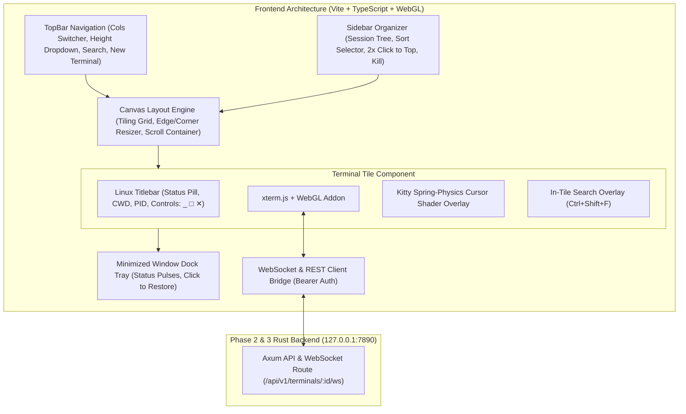

# TermCMD: Phase 4 Desktop Canvas UI & Kitty Aesthetics Execution Plan

---

## 1. Phase 4 Objectives & Scope

Phase 4 delivers the complete **Desktop Canvas User Interface** for TermCMD. Built on Vite, TypeScript, and hardware-accelerated WebGL `xterm.js`, it connects to the Phase 2/3 Rust backend and local API server. It provides a Kitty-styled terminal workspace featuring dynamic multi-column tiling, infinite vertical scrolling, edge/corner hover resizing, a collapsible session sidebar organizer, priority sorting state machines, and spring-physics cursor trailing shaders.



---

## 2. Detailed Work Breakdown Structure (WBS)

### Sub-Milestone 4.1: Frontend Scaffolding & Design System Tokens
- Setup `package.json` with dependencies:
  - `@xterm/xterm = "^5.5.0"`
  - `@xterm/addon-webgl = "^0.18.0"`
  - `@xterm/addon-fit = "^0.10.0"`
  - `@xterm/addon-search = "^0.15.0"`
  - `typescript = "^5.4.0"` & `vite = "^5.2.0"`
- Establish Kitty/Tokyo Night CSS design token system (`src/styles/`):
  - Theme colors: Canvas Background `#0A0C10`, Window Glass `#141820`, Accent Cyan `#58A6FF`, Emerald Pulse `#3FB950`, Amber Busy `#D29922`, Coral Error `#F85149`.
  - Typography: Monospaced programming fonts (`JetBrains Mono`, `Fira Code`, `Cascadia Code`, monospace fallback).

### Sub-Milestone 4.2: WebSocket & REST API Service Bridge
- Implementation of `ApiClient.ts`:
  - Automatically loads bearer token from runtime config / Tauri IPC.
  - Full CRUD operations: `createTerminal()`, `listTerminals()`, `getTerminal()`, `resizeTerminal()`, `killTerminal()`, `closeTerminal()`.
- Implementation of `PtyWebSocket.ts`:
  - Establishes full-duplex binary/text WebSocket connection to `/api/v1/terminals/:id/ws`.
  - Automatic reconnection with exponential backoff if disconnected.
  - Bi-directional piping between `xterm.js` `onData` and WebSocket frames.

### Sub-Milestone 4.3: Dynamic Tiling Grid & Layout Engine
- **Grid Density Computation**:
  - Top bar selector for `1`, `2`, `3`, or `4` columns per row.
  - Dynamically calculates column widths:
    $$\text{Width} = \frac{\text{Canvas Width} - (\text{Cols} - 1) \times \text{Gutter Width}}{\text{Cols}}$$
- **Infinite Vertical Scrolling**:
  - Custom scroll container allowing seamless vertical navigation through large numbers of concurrent terminal instances.
- **Top-Insertion Hierarchy**:
  - Newly created terminal boxes mount at the top-left of the canvas grid order.
- **Native Direct Edge & Corner Hover Resizing**:
  - Hover detection on $6\text{px}$ borders (cursor changes to `col-resize` / `row-resize` with luminous edge highlight).
  - Hover detection on $12\times 12\text{px}$ corners (cursor changes to `nwse-resize` / `nesw-resize`).
  - Dragging recalculates adjacent tile dimensions complementarily to maintain grid alignment.
  - Integrated `ResizeObserver` triggers debounced `ApiClient.resizeTerminal(cols, rows)` to synchronize backend `SIGWINCH`.

### Sub-Milestone 4.4: Terminal Tile Component & Linux Controls
- **Header Titlebar**:
  - Dynamic status badge: `[AGENT STREAMING]`, `[RUNNING]`, `[IDLE]`, `[TERMINATED (exit: code)]`.
  - Dynamic working directory (synced via `OSC 7`) and active command name.
  - Linux top-right standard control cluster: Minimize (`_`), Maximize/Restore (`□`), and Close/Kill (`✕`).
- **Productivity & Clipboard Utilities**:
  - **Copy-on-Select**: Selecting text in terminal automatically copies to clipboard.
  - **In-Tile Buffer Search (`Ctrl+Shift+F`)**: Floating search bar highlighting text matches via `@xterm/addon-search`.
  - **Post-Exit Crash Recovery**: Shows `↺ Restart Shell` button when status transitions to `TERMINATED`.

### Sub-Milestone 4.5: Kitty Spring-Physics Cursor Trailing Shader
- **WebGL / Canvas 2D Shader Overlay (`CursorTrailFX.ts`)**:
  - Synchronizes with xterm.js internal cursor coordinates $(X_{\text{cursor}}, Y_{\text{cursor}})$.
  - Spring-damper physics particle system:
    $$m \frac{d^2 \mathbf{p}}{dt^2} + c \frac{d\mathbf{p}}{dt} + k (\mathbf{p} - \mathbf{p}_{\text{target}}) = 0$$
    $(k = 240.0, c = 18.0, m = 1.0)$.
  - Renders smooth luminous trailing ribbon connecting lagging tail to leading cursor head with exponential glow falloff ($I(d) = I_0 \cdot \exp(-d^2 / 2\sigma^2)$).

### Sub-Milestone 4.6: Collapsible Sidebar Organizer & Sorting State Machine
- **Expandable / Collapsible Left Sidebar**:
  - Session tree displaying all open terminals, status dots, CWD, and last executed command.
  - Double-click any session to immediately scroll and pin it to the top position.
  - Quick close/kill action (`✕`) on every item.
- **Three Sorting & Organization Modes**:
  1. **Running Priority**: Terminals with active running commands stay pinned at the top; completed and idle terminals rank below.
  2. **Recent Activity (MRU)**: Terminals that just launched a command automatically bubble to the top.
  3. **Creation Order**: Newest opened terminals sit at the top.

### Sub-Milestone 4.7: Dock Tray & Global Keybindings
- **Minimized Dock Tray (Bottom)**:
  - Displays minimized terminal chips with live status pulse dots.
  - Clicking restores the window to its grid position.
- **Global Keybindings**:
  - `Ctrl + Alt + N` &rarr; Spawn new terminal tile at top.
  - `Ctrl + Alt + 1..4` &rarr; Toggle grid columns (1 to 4).
  - `Ctrl + Alt + W` &rarr; Close focused terminal.
  - `Ctrl + Alt + M` &rarr; Minimize focused terminal.
  - `Ctrl + Tab` / `Ctrl + Shift + Tab` &rarr; Cycle focus between open terminals.

---

## 3. Frontend Directory & Component Layout

```
src/
├── index.html
├── main.ts
├── styles/
│   ├── main.css               <-- Base layout & CSS variables
│   ├── theme.css              <-- Kitty Tokyo Night design tokens
│   ├── tiling.css             <-- Grid layout, gutters, and scrollbar
│   ├── tile.css               <-- Individual window styling & controls
│   ├── sidebar.css            <-- Sidebar tree & sort mode styles
│   └── dock.css               <-- Minimized dock tray styles
├── components/
│   ├── TopBar.ts              <-- Navigation, density selector & search
│   ├── Sidebar.ts             <-- Collapsible session organizer
│   ├── Canvas.ts              <-- Tiling manager & scroll viewport
│   ├── TerminalTile.ts        <-- Window container & Linux header
│   ├── TerminalInstance.ts    <-- xterm.js + WebGL addon wrapper
│   ├── SearchOverlay.ts       <-- In-tile search widget
│   └── DockTray.ts            <-- Minimized window dock
├── effects/
│   └── CursorTrail.ts         <-- WebGL/Canvas spring-physics shader
├── services/
│   ├── ApiClient.ts           <-- REST client with bearer auth
│   ├── PtyWebSocket.ts        <-- WebSocket streaming bridge
│   ├── SortManager.ts         <-- Sorting state machine (Priority, MRU, Creation)
│   ├── ClipboardService.ts    <-- Copy-on-select helper
│   └── KeybindingManager.ts   <-- Global keyboard shortcuts
└── types/
    └── terminal.ts            <-- Shared TypeScript interfaces
```

---

## 4. Verification & Testing Plan for Phase 4

### 4.1 Automated UI & Service Tests
1. **`test_api_client_crud`**:
   - Verifies session creation, listing, resizing, and teardown against backend API.
2. **`test_sort_manager_state_machine`**:
   - Tests sorting under Running Priority (active first), MRU (recent command first), and Creation Order.
3. **`test_tiling_math_and_reflow`**:
   - Tests column width calculation, boundary constraints ($W_{\min} = 260\text{px}$, $H_{\min} = 180\text{px}$), and adjacent tile compensation.
4. **`test_cursor_trail_physics_interpolation`**:
   - Verifies spring-damper equations converge to target cursor position within $<150\text{ms}$.

### 4.2 Interactive Verification Scenarios
- **Multi-Terminal Stress**: Open 6 concurrent terminal boxes (3 cols mode), execute simultaneous builds, verify zero UI jank ($>55\text{ FPS}$).
- **Drag Resizing**: Drag right/bottom borders and corners; verify adjacent tiles adapt smoothly and backend receives `SIGWINCH` updates.
- **Copy-on-Select**: Select text in output; verify system clipboard contains selected text without extra keystrokes.
- **Sidebar 2x Click**: Double-click a terminal at the bottom of the list; verify it instantly scrolls/pins to the top of the canvas.
