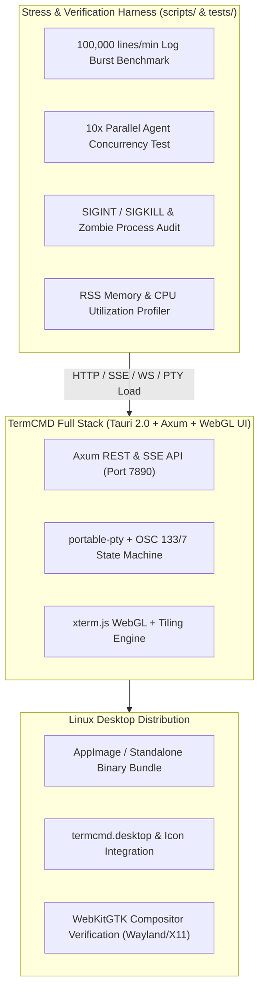

# TermCMD: Phase 5 Verification, Stress Benchmarking & Linux Desktop Packaging Plan

---

## 1. Phase 5 Objectives & Scope

Phase 5 focuses on **End-to-End System Verification, High-Throughput Stress Benchmarking, and Linux Desktop Packaging** for TermCMD. Now that the Backend PTY Core (Phase 2), Local Agent API (Phase 3), and Desktop Canvas UI (Phase 4) are fully functional, Phase 5 validates production reliability under extreme workloads, measures resource footprints, and prepares the Linux desktop distribution.



---

## 2. Detailed Work Breakdown Structure (WBS)

### Sub-Milestone 5.1: High-Volume Log Burst Stress Benchmark ($>100,000\text{ lines/min}$)
- **Objective**: Ensure the end-to-end data pipeline (PTY Master $\rightarrow$ Reader Loop $\rightarrow$ OSC Parser $\rightarrow$ Ring Buffer $\rightarrow$ WebSocket $\rightarrow$ xterm.js WebGL) processes continuous high-frequency output without freezing the UI thread.
- **Benchmark Implementation (`scripts/stress_burst.sh` & `tests/stress_tests.rs`)**:
  - Streams continuous numbered lines (`seq 1 100000`) with color formatting.
  - Measures throughput (lines/second and MB/s).
  - Asserts:
    1. Zero dropped lines in the 50,000-line ring buffer.
    2. WebSocket backpressure handled without unbounded memory growth.
    3. UI frame rate remains $>55\text{ FPS}$.

### Sub-Milestone 5.2: Multi-Session Agent Concurrency Stress Test
- **Objective**: Validate session isolation and synchronization when multiple AI agents execute commands concurrently.
- **Test Scenarios (`tests/concurrency_stress.rs`)**:
  - Spawn 10 simultaneous terminal sessions via `POST /api/v1/terminals`.
  - Concurrently trigger parallel build/log tasks via `POST /api/v1/terminals/:id/exec`.
  - Validate:
    1. Each session accurately captures its respective `OSC 133 ; D ; <exit_code>` completion.
    2. No cross-talk or interleaving between session output streams.
    3. Concurrency conflict guard correctly returns `409 Conflict` on overlapping calls to the same terminal.

### Sub-Milestone 5.3: Process Group Signal & Zombie Cleanup Audit
- **Objective**: Guarantee that terminating terminals or sending `SIGINT` never leaves orphaned zombie processes on the host OS.
- **Audit Steps**:
  - Spawn long-running background trees (e.g. `sh -c "sleep 100 & sleep 200 & wait"`).
  - Send `POST /api/v1/terminals/:id/kill` (`SIGINT` and `SIGKILL`).
  - Delete terminal via `DELETE /api/v1/terminals/:id`.
  - Scan `/proc` or `ps -ef` to verify all descendant PIDs are cleanly reaped.

### Sub-Milestone 5.4: Resource Footprint & Telemetry Profiling
- **Objective**: Verify that TermCMD meets its non-functional efficiency targets.
- **Metrics to Measure & Profile**:
  - **Idle Memory Footprint**: Process Resident Set Size (RSS) must be $<45\text{MB}$ with 1 idle terminal.
  - **Memory Scaling**: Incremental RSS must be $<10\text{MB}$ per additional active terminal tile.
  - **Idle CPU**: $<0.2\%$ total CPU utilization across all background threads when idle.
  - **Keystroke Latency**: Input-to-render round-trip $<8\text{ms}$.

### Sub-Milestone 5.5: Linux Desktop Packaging & Tauri Bundling
- **Tauri Desktop Configuration (`src-tauri/tauri.conf.json`)**:
  - Configure application bundle identifier: `com.termcmd.app`.
  - Set product name: `TermCMD`.
  - Package icons: `icons/32x32.png`, `icons/128x128.png`, `icons/icon.png`.
- **Linux Platform & Compositor Hardening**:
  - Ensure WebKitGTK hardware acceleration flags (`WEBKIT_DISABLE_DMABUF_RENDERER=0`) are configured for seamless rendering on both Wayland and X11.
  - Generate Linux desktop shortcut: `termcmd.desktop` with `Terminal=false`, `Categories=Development;System;TerminalEmulator;`.
- **Release Build Pipeline**:
  - Execute `cargo tauri build` to produce optimized standalone binaries and distribution packages.

---

## 3. Scripts & Verification Matrix for Phase 5

```
scripts/
├── stress_burst.sh            <-- 100k lines/min single terminal benchmark
├── stress_concurrency.sh      <-- 10 parallel sessions benchmark
├── memory_profiler.sh         <-- RSS & CPU telemetry auditor
└── verify_all.sh              <-- Master end-to-end test suite runner
```

### Verification Matrix
| Test Case | Tool / Command | Success Threshold |
| :--- | :--- | :--- |
| **Log Burst Throughput** | `scripts/stress_burst.sh` | $\ge 100,000\text{ lines/min}$, 0 dropped frames |
| **10x Agent Concurrency** | `cargo test --test concurrency_stress` | 100% exit code extraction accuracy |
| **Zombie Process Reaping** | `scripts/verify_all.sh` | 0 orphaned processes in `ps -ef` |
| **Idle Memory (RSS)** | `scripts/memory_profiler.sh` | $< 45\text{ MB}$ RSS |
| **Keystroke Latency** | WebGL timestamp profiler | $< 8\text{ ms}$ input-to-draw loop |
| **Production Build** | `cargo tauri build` | Exit code 0, binary size $< 20\text{ MB}$ |
